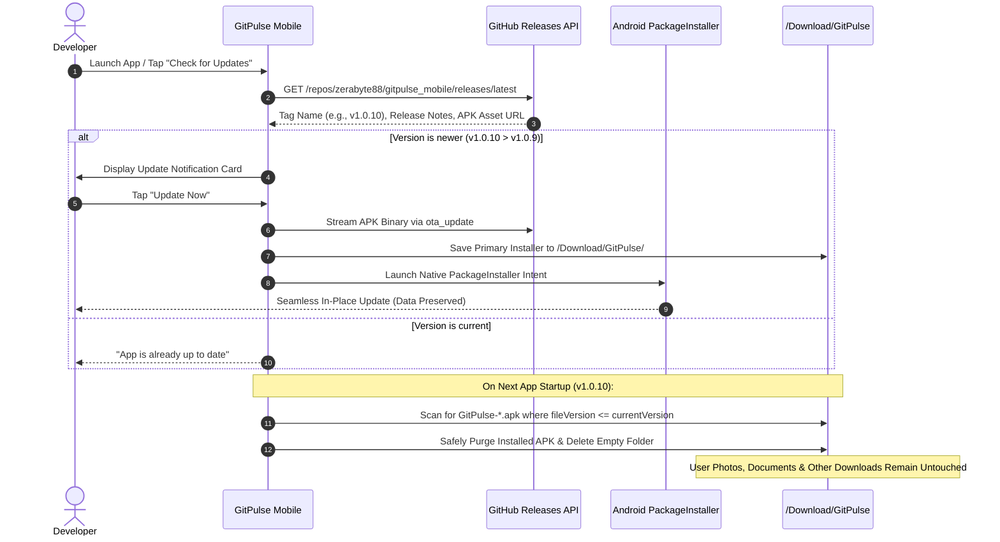
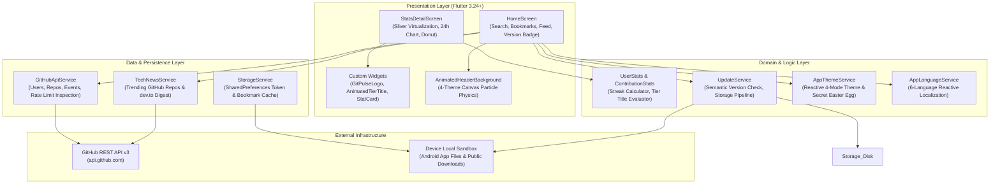

# GitPulse Mobile

<div align="center">

<p align="center">
  
  &nbsp;&nbsp;&nbsp;&nbsp;
  
  &nbsp;&nbsp;&nbsp;&nbsp;
  
</p>

### The Rhythm of Your Code. On-Device Developer Telemetry & Productivity Analytics.

[](https://github.com/zerabyte88/gitpulse_mobile/releases)
[](pubspec.yaml)
[](https://flutter.dev)
[](https://dart.dev)
[](https://developer.android.com)
[-success?style=flat-square&logo=checkmarx&logoColor=white)](test/widget_test.dart)
[](#system-architecture)
[](LICENSE)

<p align="center">
  <b>GitPulse Mobile</b> transforms raw GitHub REST API v3 payloads into intuitive 24-hour productivity rhythms, cumulative portfolio impact telemetry, and habit-based commit tiers. Engineered for performance and privacy, all data processing, charting, and storage occur <b>100% on-device</b> with zero intermediary proxy servers.
</p>

<p align="center">
  <a href="#why-gitpulse">Why GitPulse</a> •
  <a href="#core-features">Core Features</a> •
  <a href="#visual-identity--theme-engine">Themes & Visuals</a> •
  <a href="#commit-activity-tier-engine">Commit Tiers</a> •
  <a href="#in-app-updater--storage-pipeline">In-App Updater</a> •
  <a href="#system-architecture">Architecture</a> •
  <a href="#performance--engineering">Performance</a> •
  <a href="#security--privacy">Security</a> •
  <a href="#getting-started">Getting Started</a>
</p>

</div>

---

## Why GitPulse?

The standard GitHub contribution graph provides a daily snapshot of activity frequency, but lacks temporal clarity and portfolio-level synthesis:

| Metric Dimension | Standard GitHub Experience | GitPulse Mobile Engine |
| :--- | :--- | :--- |
| **Temporal Granularity** | Flat daily boxes without time-of-day visibility | **24-Hour Activity Histogram**: Bins commits & PRs by local hour (00:00–23:00) |
| **Portfolio Aggregation** | Scattered stars, forks, and codebase sizes across repos | **Consolidated Portfolio Telemetry**: Total stars, forks, and language volume |
| **Activity Habits** | Generic contribution counters | **6 Continuous Animated Tiers**: Physics-based shader & particle effects |
| **Mobile Updates** | Manual APK downloads and uninstall/reinstall friction | **In-App OTA Updater**: Background streaming & automated safe storage cleanup |
| **Visual Aesthetics** | Static dark/light mode toggle | **4 Dynamic Themes**: Full-header ambient particle FX & secret Sakura mode |
| **Privacy & Control** | Third-party analytics trackers common in mobile wrappers | **Zero Intermediary Servers**: Direct device-to-GitHub TLS 1.3 communication |

---

## Core Features

### 📊 24-Hour Productivity Rhythm
- Converts UTC event timestamps from the GitHub API into the user's local device timezone (00:00–23:00).
- Renders an interactive 24-bar histogram using `fl_chart` to reveal peak engineering hours.

### 🌐 Language Footprint & Portfolio Analytics
- **Language Distribution**: Multi-language donut chart weighted by repository codebase volume with authentic language colors.
- **Portfolio Aggregation**: Real-time summation of cumulative stargazers, forks, repository counts (original vs. forked), and follower ratios.
- **Sliver Virtualization**: Smooth 60fps scrolling across 100+ repositories using `CustomScrollView` and `SliverList.builder`.

### ⚡ Smart Rate-Limit & Token Management
- Strongly-typed `GitHubApiException` intercepts HTTP 403, 429, and `x-ratelimit-remaining == 0`.
- Supports optional GitHub Personal Access Tokens (PAT) to elevate rate limits from 60 to 5,000 requests/hour, safely sandboxed in `SharedPreferences`.

### 🌍 6-Language Native Localization (i18n)
- Full native translation coverage switchable on-the-fly without restarting:
  - 🇮🇩 **Bahasa Indonesia**
  - 🇺🇸 **English**
  - 🇯🇵 **日本語 (Japanese)**
  - 🇨🇳 **简体中文 (Simplified Chinese)**
  - 🇹🇼 **繁體中文 (Traditional Chinese)**
  - 🇰🇷 **한국어 (Korean)**
- Non-truncating layout geometry ensures full language names and long phrases display cleanly across all screen sizes.

### 📰 Curated Tech News & Ecosystem Feed
- Aggregates top trending GitHub repositories via the GitHub Search API alongside curated engineering articles from dev.to.
- Category filter chips (**Trending**, **All**, **GitHub**, **Web Dev**) with image decoding constrained to `cacheWidth: 450` for minimal GPU overhead.

---

## Visual Identity & Theme Engine

### Bespoke GitPulse Vector Logo
The custom vector logo (`GitPulseLogo`) represents developer rhythm by intertwining:
1. **Git Branch Topology**: Base commit node branching out toward HEAD.
2. **ECG Heartbeat Pulse**: Cardiac waveform spike (R-wave peak and S-wave valley) symbolizing the developer's vitality and commit pulse.
3. **Traveling Electric Spark**: An active energy spark traversing the branch line in synchronization with the animation loop.

### Dynamic Full-Header Particle System
The header `AppBar.flexibleSpace` hosts an interactive, GPU-accelerated Canvas particle background tailored to each active theme:

| Theme Mode | Palette Accents | Header Ambient Animation |
| :--- | :--- | :--- |
| **Dark (Midnight Navy)** | Background `#0D1117` • Surface `#161B22` • Accent `#58A6FF` | **Water Ripples & Ambient Bubbles** floating organically |
| **AMOLED (Pure Black)** | Background `#000000` • Surface `#101012` • Accent `#00E5FF` | **Crescent Moon & Twinkling Stars** in deep space |
| **AMOLED Sakura 🌸** | Background `#000000` • Surface `#150C18` • Accent `#FF5C8A` | **Falling Sakura Blossom Petals** with swaying wind physics |
| **Light (GitHub Pure)** | Background `#F6F8FA` • Surface `#FFFFFF` • Accent `#0969DA` | **Autumn Falling Leaves** with rotational drift |

> [!TIP]
> **🌸 How to Unlock Secret AMOLED Sakura Mode**:
> 1. Open **Settings** (gear icon in the top right).
> 2. Locate the **Theme (Tema Tampilan)** section.
> 3. Tap the **AMOLED** card **10 times in rapid succession**.
> 4. Haptic feedback triggers and AMOLED Sakura mode is permanently unlocked in preferences.

---

## Commit Activity Tier Engine

Developers receive a continuous animated tier badge based on their commit streak and annual contribution volume (`ContributionStats.determineTitle`):

| Tier Level | Badge Title | Criteria | Visual Animation Effect |
| :--- | :--- | :--- | :--- |
| **Tier 1** | **Code Titan** | `Current Streak >= 14` **or** `Longest >= 30` **or** `This Year >= 350` | 🔥 **Blazing Flame & Magma Physics**: Vertical heatwave shader with rising ember sparks |
| **Tier 2** | **Relentless Committer** | `Current Streak >= 5` **or** `Longest >= 14` **or** `This Year >= 100` | ⚡ **Electric Plasma Arc**: High-voltage electrical crackle with fast micro-sparks |
| **Tier 3** | **Consistent Builder** | `Current Streak >= 2` **or** `Longest >= 7` **or** `This Year >= 30` | 💻 **Emerald Cyber Matrix**: Digital scanline beam sweep with matrix illumination |
| **Tier 4** | **Weekend Warrior** | `Current Streak >= 1` **or** `Longest >= 2` **or** `This Year >= 8` | ☀️ **Solar Amber Shimmer**: Radiant golden sunburst with sweeping angular gleam |
| **Tier 5** | **Dormant Explorer** | `This Year > 0` **or** `Total Contributions > 0` | ✨ **Cosmic Starlight Nebula**: Calm cosmic drift with gently pulsating stellar dust |
| **Tier 6** | **Fresh Sprout** | *Default / 0 Contributions Recorded* | 🌱 **Spring Dewdrop**: Gentle organic scale breathing with spring dew shimmer |

---

## In-App Updater & Storage Pipeline

GitPulse features a built-in OTA update mechanism that eliminates manual browser downloads and APK reinstalls while strictly safeguarding user storage:



### Storage Safety Guarantees
- **Targeted Deletion Only**: The cleanup routine strictly targets filenames matching `^gitpulse[-_]v?[0-9.]+.*\.apk$` and `gitpulse-latest.apk`.
- **Version Guard**: An APK is removed only if its embedded version is less than or equal to the currently running app version (`fileVersion <= activeVersion`).
- **Zero Data Loss**: Files outside the GitPulse naming pattern (photos, documents, other application APKs) are completely untouched.

---

## System Architecture

The application is structured following **Clean Layered Architecture** to maintain clean boundaries between UI, business rules, and external data services:



---

## Performance & Engineering

GitPulse Mobile is optimized for 60fps rendering even on low-spec mobile hardware:

1. **Sliver List Virtualization**: The repository view uses `CustomScrollView` and `SliverList.builder`. Only visible repository cards are laid out and rendered, preventing memory spikes on profiles with up to 100 repositories.
2. **Memoized Repository Sorting**: Repository sorting operations are memoized and recomputed only when the user changes sorting criteria (Stars, Forks, Updated), avoiding recalculations during screen transitions.
3. **RepaintBoundary Isolation**: Each repository tile and animated tier title is wrapped in a `RepaintBoundary` to isolate canvas repaints and prevent cascading UI rebuilds.
4. **Constrained Image Decoding**: Dev.to and GitHub thumbnails decode with `cacheWidth: 450` with lightweight placeholders, reducing GPU cache memory pressure.
5. **In-Memory History & Bookmark Caching**: Recent searches and bookmarked profiles are cached in memory after reading from disk, eliminating redundant JSON deserialization on every frame build.

---

## Security & Privacy

- **Zero Intermediary Servers**: All network requests originate directly from the client device to official GitHub servers (`api.github.com`) over TLS 1.3.
- **Sandboxed Token Storage**: Optional Personal Access Tokens (PAT) reside strictly within Android's private app storage via `SharedPreferences`. Tokens are never shared or sent to external servers.
- **Read-Only Scopes**: GitPulse queries only public GitHub data and never requests write permissions or repository administration scopes.
- **No Third-Party Telemetry**: Zero analytics SDKs, advertising trackers, or fingerprinting scripts.

---

## Technology Stack

| Component | Library / Package | Version | Architectural Role |
| :--- | :--- | :--- | :--- |
| **Framework** | [Flutter](https://flutter.dev) | `>=3.24.0` | AOT compiled cross-platform framework for Android & Web |
| **Language** | [Dart](https://dart.dev) | `>=3.5.0` | Sound null-safety, pattern matching & record types |
| **Visual Charts** | [fl_chart](https://pub.dev/packages/fl_chart) | `^1.2.0` | Hardware-accelerated 24h activity histogram & language donut |
| **OTA Updater** | [ota_update](https://pub.dev/packages/ota_update) | `^7.1.0` | Background native Android PackageInstaller OTA engine |
| **Networking** | [http](https://pub.dev/packages/http) | `^1.6.0` | Composable HTTP client for GitHub REST API v3 queries |
| **Typography** | [google_fonts](https://pub.dev/packages/google_fonts) | `^8.2.1` | Professional Inter typeface styling |
| **Persistence** | [shared_preferences](https://pub.dev/packages/shared_preferences) | `^2.5.5` | Sandboxed local storage for bookmarks, themes, & tokens |
| **Formatting** | [intl](https://pub.dev/packages/intl) | `^0.20.3` | Localized number formatting & date manipulation |
| **Browser Links** | [url_launcher](https://pub.dev/packages/url_launcher) | `^6.3.2` | External browser routing for repositories & articles |
| **Markdown** | [flutter_markdown](https://pub.dev/packages/flutter_markdown) | `^0.7.7+1` | In-app native GitHub README.md markdown parsing & rendering |
| **Testing** | [flutter_test](https://api.flutter.dev/flutter/flutter_test/flutter_test-library.html) | SDK | 35/35 unit, model, and widget verification tests |

---

## Project Directory Structure

```text
gitpulse_mobile/
├── .github/
│   └── workflows/
│       └── main.yml                 # CI/CD: Quality gate, 64-bit ARM APK build & GitHub Releases
├── android/                         # Android platform host configuration & Gradle scripts
├── lib/
│   ├── main.dart                    # Application entrypoint & startup auto-cleanup routine
│   ├── localization/                # 6-language internationalization system
│   │   ├── app_language.dart        # Language enum, locales & metadata
│   │   └── app_localizations.dart   # Translation dictionaries & pluralization
│   ├── models/                      # Domain entities & telemetry engines
│   │   ├── bookmarked_user.dart     # Bookmarked profile serialization
│   │   ├── contribution_stats.dart  # Streak calculator & tier determination
│   │   ├── github_rate_limit.dart   # API rate-limit state tracking
│   │   ├── github_repo.dart         # Repository schema parser & owner/size extractors
│   │   ├── github_user.dart         # User profile schema parser
│   │   ├── tech_news.dart           # Curated tech news & trending model
│   │   └── user_stats.dart          # Aggregated user statistics & languages
│   ├── screens/                     # UI screen controllers
│   │   ├── home_screen.dart         # Search, bookmarks, tech news & animated header
│   │   ├── repo_detail_screen.dart  # Native in-app repository detail & README.md markdown viewer
│   │   └── stats_detail_screen.dart # Interactive analytics dashboard (Virtualized Sliver)
│   ├── services/                    # Data access & persistence layer
│   │   ├── app_language_service.dart# Language preference state manager
│   │   ├── app_theme_service.dart   # 4-mode theme state notifier & easter egg unlocker
│   │   ├── github_api_service.dart  # GitHub REST API v3 client with error mapping & README decoder
│   │   ├── storage_service.dart     # SharedPreferences persistence wrapper
│   │   ├── tech_news_service.dart   # Trending repositories & dev.to article fetcher
│   │   └── update_service.dart      # In-app updater, APK downloads & safe cleanup
│   ├── theme/                       # Design system tokens & configuration
│   │   └── app_theme.dart           # 4-theme color palettes, typography & AppConfig
│   └── widgets/                     # Reusable modular UI components
│       ├── activity_chart.dart      # 24-hour activity bar chart (fl_chart)
│       ├── animated_app_header.dart # Bespoke GitPulse vector logo & dynamic particle Canvas
│       ├── animated_tier_title.dart # 6-level continuous animated tier badges
│       ├── language_chart.dart      # Language distribution donut chart (fl_chart)
│       ├── repo_tile.dart           # Interactive repository tile with in-app & external navigation
│       ├── settings_sheet.dart      # Settings modal sheet (Theme, Language, PAT, Update)
│       ├── stat_card.dart           # Non-truncating summary metric cards
│       └── tech_news_card.dart      # Trending digest & news cards
├── test/
│   └── widget_test.dart             # Comprehensive test suite (35/35 passing)
└── pubspec.yaml                     # Dependency manifest & version metadata (v1.0.10+11)
```

---

## Getting Started

### Prerequisites
- **Flutter SDK**: `3.24.0` or higher
- **Dart SDK**: `3.5.0` or higher
- **Java Development Kit**: OpenJDK 17
- **Target**: Physical Android device (API 28+), Android Emulator, or Google Chrome

### Setup & Execution

1. **Clone the Repository**:
   ```bash
   git clone https://github.com/zerabyte88/gitpulse_mobile.git
   cd gitpulse_mobile
   ```

2. **Install Dependencies**:
   ```bash
   flutter pub get
   ```

3. **Run Code Quality Analysis & Tests**:
   ```bash
   flutter analyze
   flutter test
   ```

4. **Launch Application**:
   - For Android:
     ```bash
     flutter run -d android
     ```
   - For Web:
     ```bash
     flutter run -d chrome
     ```

5. **Build 64-bit Release APK**:
   ```bash
   flutter build apk --release --target-platform android-arm64
   # Binary output: build/app/outputs/flutter-apk/app-release.apk
   ```

---

## CI/CD Pipeline

The project uses GitHub Actions (`.github/workflows/main.yml`) for automated testing and builds:
- **Quality Gate**: Executes `flutter analyze` and `flutter test` on every push and pull request.
- **64-bit APK Compilation**: Compiles release APK specifically targeting `android-arm64` (`arm64-v8a`).
- **Checksum Verification**: Generates SHA-256 checksums alongside compiled APK assets.
- **Release Automation**: Publishes release binaries directly to GitHub Releases upon tag creation (`v*`).

---

## License

This project is licensed under the [MIT License](LICENSE).

<div align="center">
  <br/>
  <a href="https://github.com/zerabyte88">
    
  </a>
  <br/>
  <sub>Developed with ❤️ by <a href="https://github.com/zerabyte88">zerabyte88</a> (Creator & Maintainer)</sub>
</div>
