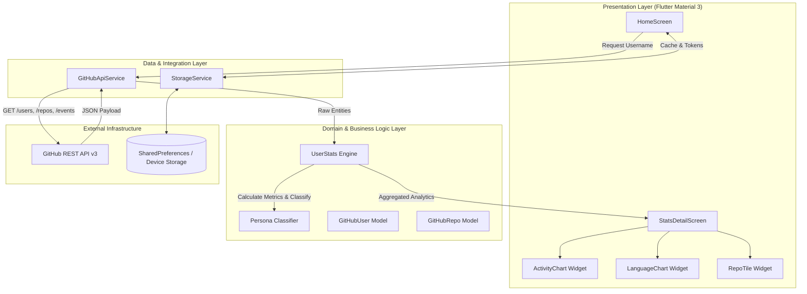

# ⚡ GitPulse Mobile

<div align="center">

<p align="center">
  
  &nbsp;&nbsp;&nbsp;&nbsp;
  
  &nbsp;&nbsp;&nbsp;&nbsp;
  
</p>

### Enterprise-Grade Developer Analytics & Work Rhythm Intelligence

[](https://github.com/zerabyte88/gitpulse_mobile/releases)
[](https://flutter.dev)
[](https://dart.dev)
[](https://developer.android.com)
[](.github/workflows/build-apk.yml)
[-success?style=flat-square)](test/widget_test.dart)
[](#-arsitektur-sistem--alur-data)
[](LICENSE)

<p align="center">
  <b>GitPulse Mobile</b> adalah aplikasi analitik telemetri developer berbasis Flutter yang mentransformasikan data mentah GitHub REST API v3 menjadi visualisasi ritme produktivitas 24-jam, agregasi metrik portofolio kumulatif, serta klasifikasi persona rekayasa perangkat lunak secara deterministik.
</p>

<p align="center">
  <a href="#-latar-belakang--pernyataan-masalah">Latar Belakang</a> •
  <a href="#-fitur-unggulan">Fitur Unggulan</a> •
  <a href="#-arsitektur-sistem--alur-data">Arsitektur & Diagram</a> •
  <a href="#-matriks-klasifikasi-persona">Matriks Persona</a> •
  <a href="#-keamanan--tata-kelola-privasi-data">Keamanan</a> •
  <a href="#-panduan-instalasi--pengembangan-lokal">Instalasi</a> •
  <a href="#-alur-kerja-cicd--distribusi-apk">CI/CD APK</a> •
  <a href="#-rencana-pengembangan-strategis">Roadmap</a>
</p>

</div>

---

## 📌 Latar Belakang & Pernyataan Masalah

Grafik kontribusi standar GitHub ("kotak hijau") menyajikan frekuensi aktivitas harian, namun memiliki keterbatasan fundamental:
- **Ketiadaan Konteks Waktu Produktif**: Tidak membedakan apakah sebuah komit dilakukan di tengah malam, awal fajar, atau jam kerja formal.
- **Fragmentasi Dampak Portofolio**: Membutuhkan agregasi manual untuk menghitung total impresi bintang (*stargazers*) dan *forks* yang tersebar di puluhan repositori.
- **Ketiadaan Profiling Kualitatif**: Sulit mengidentifikasi spesialisasi arsitektur seorang pengembang (misalnya fleksibilitas multibahasa vs fokus mendalam pada satu ekosistem).

**GitPulse Mobile** mengatasi keterbatasan tersebut dengan mengagregasi data repositori, profil, dan *public events stream* menjadi satu dasbor analitik komprehensif, cepat, dan terdesentralisasi langsung pada perangkat klien.

---

## 🌟 Fitur Unggulan

<table>
  <thead>
    <tr>
      <th width="50%">Fitur & Spesifikasi</th>
      <th width="50%">Deskripsi Teknis</th>
    </tr>
  </thead>
  <tbody>
    <tr>
      <td>
        <b>⚡ Visualisasi Ritme Produktivitas 24-Jam</b><br/>
        <i>(Peak Coding Hours Detection)</i>
      </td>
      <td>
        Memetakan seluruh aktivitas event publik GitHub ke dalam histogram 24-bar bertenaga <code>fl_chart</code>. Mengidentifikasi jendela waktu saat pengembang paling aktif mengeksekusi komit, *pull request*, dan manajemen isu.
      </td>
    </tr>
    <tr>
      <td>
        <b>🎭 Mesin Klasifikasi Persona Pengembang</b><br/>
        <i>(Deterministic Developer Persona Engine)</i>
      </td>
      <td>
        Mengevaluasi kebiasaan kerja pengembang berdasarkan matriks metrik kuantitatif dan menetapkan gelar persona profesional secara otomatis.
      </td>
    </tr>
    <tr>
      <td>
        <b>📊 Analisis Jejak Bahasa Pemrograman</b><br/>
        <i>(Interactive Language Distribution)</i>
      </td>
      <td>
        Donut chart interaktif yang merefleksikan komposisi bahasa pemrograman utama di seluruh portofolio publik beserta persentase kontribusinya.
      </td>
    </tr>
    <tr>
      <td>
        <b>🔍 Agregasi Portofolio Terpadu</b><br/>
        <i>(Consolidated Profile Analytics)</i>
      </td>
      <td>
        Mengkalkulasi total bintang (*stars*) kumulatif, total percabangan (*forks*), jumlah repositori orisinal vs forked, serta rasio pengikut tanpa memerlukan server perantara.
      </td>
    </tr>
    <tr>
      <td>
        <b>🔖 Penyimpanan & Akses Offline</b><br/>
        <i>(Persistent Local Cache Engine)</i>
      </td>
      <td>
        Memungkinkan penyimpanan profil developer penting ke dalam penyimpanan persisten lokal (<code>shared_preferences</code>) untuk akses instan tanpa penundaan latensi jaringan.
      </td>
    </tr>
    <tr>
      <td>
        <b>🔑 Manajemen Kuota API Adaptif</b><br/>
        <i>(Dual Rate-Limiting Strategy)</i>
      </td>
      <td>
        Mendukung mode permintaan anonim (60 request/jam) serta autentikasi Personal Access Token (5.000 request/jam) yang tersimpan aman pada ruang *sandbox* aplikasi.
      </td>
    </tr>
    <tr>
      <td>
        <b>📋 Generator Ringkasan Metrik Sosial</b><br/>
        <i>(One-Click Shareable Telemetry)</i>
      </td>
      <td>
        Menyusun ringkasan statistik performa ke dalam format teks terstruktur yang siap dipublikasikan ke LinkedIn, X/Twitter, atau berkas resume teknis.
      </td>
    </tr>
  </tbody>
</table>

---

## 🏛️ Arsitektur Sistem & Alur Data

Aplikasi ini mengimplementasikan pola **Clean Architecture (Layered)** untuk memastikan independensi logika bisnis, kemudahan pengujian unit, dan modularitas antarmuka:



### Struktur Direktori Repositori

```text
gitpulse_mobile/
├── .github/
│   └── workflows/
│       └── build-apk.yml            # Pipeline CI/CD otomatisasi build APK rilis
├── android/                         # Konfigurasi platform Android (Gradle, Manifest)
├── lib/
│   ├── main.dart                    # Titik masuk aplikasi & konfigurasi tema global
│   ├── models/                      # Entitas data & mesin kalkulasi analitik
│   │   ├── github_repo.dart         # Model deserialisasi repositori
│   │   ├── github_user.dart         # Model deserialisasi profil pengguna
│   │   └── user_stats.dart          # Engine kalkulasi metrik, ritme jam, & persona
│   ├── screens/                     # Kontroler tampilan layar
│   │   ├── home_screen.dart         # Layar penelusuran, riwayat bookmark, & dialog token
│   │   └── stats_detail_screen.dart # Dasbor analitik metrik lengkap & visualisasi
│   ├── services/                    # Lapisan komunikasi jaringan & persistensi data
│   │   ├── github_api_service.dart   # Klien HTTP GitHub REST API v3
│   │   └── storage_service.dart     # Tata kelola penyimpanan lokal terisolasi
│   ├── theme/                       # Sistem desain antarmuka
│   │   └── app_theme.dart           # Definisi palet warna Slate Midnight & tipografi Outfit
│   └── widgets/                     # Komponen antarmuka modular
│       ├── activity_chart.dart      # Komponen grafik batang 24-jam fl_chart
│       ├── language_chart.dart      # Komponen grafik donat fl_chart
│       ├── repo_tile.dart           # Komponen representasi repositori
│       └── stat_card.dart           # Komponen metrik ringkas
├── test/
│   └── widget_test.dart             # Berkas pengujian unit model & kalkulasi metrik
├── web/                             # Titik masuk platform Web / PWA
└── pubspec.yaml                     # Manifest dependensi & metadata proyek
```

---

## 🎯 Matriks Klasifikasi Persona

Mesin klasifikasi persona mengevaluasi atribut pengguna menggunakan urutan prioritas deterministik berikut:

| Persona | Kriteria Logika | Implikasi Karakteristik |
| :--- | :--- | :--- |
| **🌟 Star Magnet** | `Total Stars >= 100` | Repositori memiliki dampak terbukti dan diakui secara luas oleh komunitas global. |
| **⚡ Polyglot Architect** | `Jumlah Bahasa Unik >= 4` | Fleksibilitas tinggi dalam menggunakan berbagai paradigma dan tumpukan teknologi. |
| **🦉 Midnight Owl Coder** | `Event Malam (22:00–04:59) > Event Pagi & Siang` | Produktivitas dan fokus rekayasa perangkat lunak dominan pada malam hari. |
| **🌅 Early Bird Developer** | `Event Pagi (05:00–11:59) > Event Siang & Malam` | Ritme eksekusi terfokus di awal hari dengan konsistensi komit pagi. |
| **🚀 Prolific Builder** | `Total Repositori Publik > 20` | Agresif dalam merealisasikan prototipe dan mempublikasikan karya ke publik. |
| **💻 Dedicated Craftsman** | *Kondisi Dasar (Default)* | Menjaga kualitas dan konsistensi rekayasa perangkat lunak secara berkelanjutan. |

---

## 🔒 Keamanan & Tata Kelola Privasi Data

GitPulse Mobile dirancang dengan prinsip **Privacy-First**:

1. **Komunikasi Langsung Klien-ke-Server**: Seluruh transaksi jaringan diarahkan secara langsung ke domain resmi `api.github.com` melalui protokol TLS 1.3. Tidak ada server proksi atau backend perantara milik pihak ketiga.
2. **Isolasi Token Akses Pribadi (PAT)**: Token yang dimasukkan oleh pengguna hanya disimpan di dalam memori persisten perangkat (*Android internal app-sandbox*). Token tidak pernah dicatat pada log (*logging*) ataupun dikirimkan ke pihak luar.
3. **Prinsip Hak Akses Minimal (Least Privilege)**: GitPulse hanya membutuhkan akses pembacaan data publik. Pengguna tidak perlu memberikan *scope* izin tulis (*write*) atau akses ke repositori privat.
4. **Nol Pelacakan Telemetri**: Bebas dari SDK analitik, iklan pihak ketiga, ataupun pelacak perilaku pengguna.

---

## 🛠️ Tumpukan Teknologi (Tech Stack)

| Kategori | Komponen | Versi | Justifikasi Penggunaan |
| :--- | :--- | :--- | :--- |
| **Framework** | [Flutter](https://flutter.dev) | `>=3.24.0` | Kompilasi native performa tinggi (*AOT compilation*) untuk Android dan Web |
| **Bahasa** | [Dart](https://dart.dev) | `>=3.5.0` | Menjamin keamanan tipe (*sound null safety*) dan konkurensi terstruktur |
| **Visualisasi** | [fl_chart](https://pub.dev/packages/fl_chart) | `^1.2.0` | Rendering grafik vektor performa tinggi dengan dukungan interaksi sentuh |
| **Jaringan** | [http](https://pub.dev/packages/http) | `^1.6.0` | Klien HTTP teruji untuk interaksi RESTful API |
| **Tipografi** | [google_fonts](https://pub.dev/packages/google_fonts) | `^8.2.1` | Penggunaan keluarga font modern `Outfit` |
| **Persistensi** | [shared_preferences](https://pub.dev/packages/shared_preferences) | `^2.5.5` | Abstraksi penyimpanan *key-value* lokal tingkat sistem operasi |
| **Formating** | [intl](https://pub.dev/packages/intl) | `^0.20.3` | Konversi zona waktu ISO 8601 dan pemformatan metrik numerik |
| **Kualitas Kode**| [flutter_lints](https://pub.dev/packages/flutter_lints) | `^6.0.0` | Standar aturan linting resmi Flutter |

---

## 💻 Panduan Instalasi & Pengembangan Lokal

### Prasyarat Lingkungan
- **Flutter SDK**: Versi `3.24.0` atau yang lebih mutakhir
- **Dart SDK**: Versi `3.5.0` atau yang lebih mutakhir
- **Java Development Kit (JDK)**: OpenJDK versi 17
- **Perangkat Sasaran**: Perangkat fisik Android dengan USB Debugging aktif, Emulator Android (API Level 28+), atau peramban Google Chrome

### Prosedur Menjalankan Proyek

1. **Melakukan Kloning Repositori**:
   ```bash
   git clone https://github.com/zerabyte88/gitpulse_mobile.git
   cd gitpulse_mobile
   ```

2. **Mengambil Seluruh Dependensi Proyek**:
   ```bash
   flutter pub get
   ```

3. **Menjalankan Verifikasi Kualitas & Pengujian Unit**:
   ```bash
   flutter analyze
   flutter test
   ```

4. **Menjalankan Aplikasi pada Lingkungan Pengembangan**:
   * Menjalankan pada Platform Web:
     ```bash
     flutter run -d chrome
     ```
   * Menjalankan pada Perangkat Android:
     ```bash
     flutter run -d android
     ```

5. **Membangun Berkas APK Rilis Secara Mandiri**:
   ```bash
   flutter build apk --release
   # Berkas biner tersedia di: build/app/outputs/flutter-apk/app-release.apk
   ```

---

## 🤖 Alur Kerja CI/CD & Distribusi APK

Repositori ini telah mengintegrasikan alur kerja otomatisasi **GitHub Actions** (`.github/workflows/build-apk.yml`) untuk menjamin integritas perangkat lunak sebelum proses rilis:

```mermaid
graph LR
    Push[Push ke main / master] --> Checkout[Checkout Kode]
    Checkout --> SetupJava[Konfigurasi JDK 17]
    SetupJava --> SetupFlutter[Konfigurasi Flutter Stable]
    SetupFlutter --> PubGet[Instal Dependensi]
    PubGet --> Analyze[flutter analyze]
    Analyze --> Test[flutter test]
    Test --> Build[flutter build apk --release]
    Build --> Upload[Upload Artifact APK]
```



### Prosedur Mengunduh Berkas APK Rilis:
1. Akses halaman repositori di GitHub.
2. Navigasikan ke tab **Actions**.
3. Pilih eksekusi alur kerja **Build & Release GitPulse APK** terbaru dengan status centang hijau.
4. Pada bagian **Artifacts** di akhir halaman, klik dan unduh **GitPulse-Android-APK**.
5. Ekstrak arsip ZIP dan pasang `app-release.apk` pada perangkat Android Anda.

---

## 🗺️ Rencana Pengembangan Strategis (Roadmap)

- [x] Agregasi metrik portofolio komprehensif & kalkulasi dampak bintang.
- [x] Visualisasi histogram 24-jam ritme kerja pengembang.
- [x] Mesin klasifikasi persona berbasis aturan heuristik.
- [x] Pengurutan repositori terbaik berdasarkan popularitas dan fork.
- [x] Penyimpanan riwayat lokal & integrasi Personal Access Token.
- [ ] **Ekspor Dasbor Grafis**: Pembuatan kartu metrik visual beresolusi tinggi (format PNG/SVG) untuk media sosial.
- [ ] **Komparasi Profil *Head-to-Head***: Analisis perbandingan produktivitas dan tumpukan teknologi antara dua pengembang.
- [ ] **Rekapitulasi Tahunan (Yearly Wrapped)**: Visualisasi metrik tahunan berkala.
- [ ] **Widget Layar Utama Android**: Pemantauan metrik langsung melalui widget antarmuka sistem operasi.

---

## 🤝 Tata Kelola Kontribusi

Kontribusi kode mengikuti standar industri rekayasa perangkat lunak. Silakan ikuti prosedur berikut:

1. Buat salinan (*Fork*) repositori ini ke akun GitHub Anda.
2. Buat cabang fitur baru dengan format penamaan semantik:
   ```bash
   git checkout -b feat/nama-fitur-baru
   ```
3. Lakukan komit perubahan dengan mengikuti konvensi **Conventional Commits**:
   ```bash
   git commit -m "feat(analytics): implementasi visualisasi rasio merge PR"
   ```
4. Pastikan verifikasi statis dan pengujian unit terpenuhi:
   ```bash
   flutter analyze && flutter test
   ```
5. Unggah cabang Anda ke repositori asal:
   ```bash
   git push origin feat/nama-fitur-baru
   ```
6. Buka **Pull Request** dengan menyertakan deskripsi teknis perubahan secara komprehensif.

---

## 📄 Lisensi

Proyek ini berada di bawah naungan [MIT License](LICENSE). Anda memiliki kebebasan untuk menggunakan, mempelajari, memodifikasi, serta mendistribusikan kode sumber ini sesuai dengan ketentuan lisensi terbuka.

